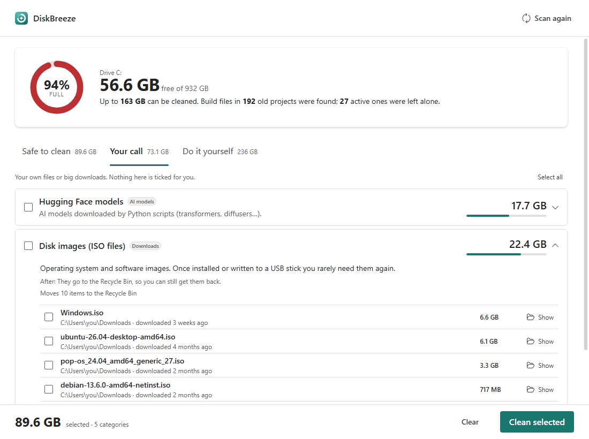
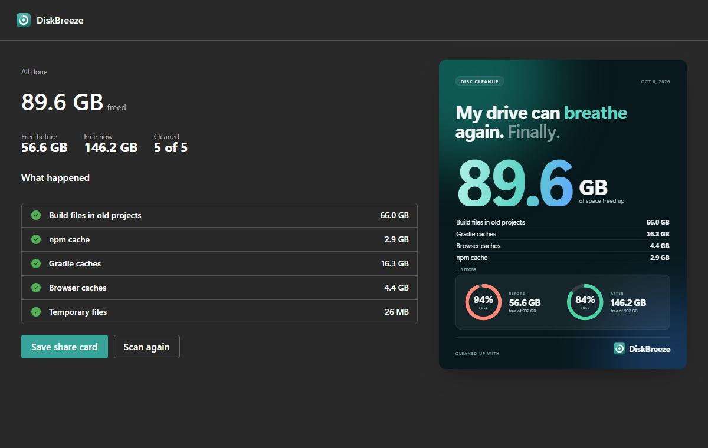

# DiskBreeze

Find out what's filling your disk, understand it in plain English, and clean only what you choose.



## Download

Get the Windows installer from the [releases page](https://github.com/SC136/diskbreeze/releases) (about 2 MB). It isn't code-signed yet, so Windows SmartScreen may warn on first run: click **More info → Run anyway**. Scanning never changes anything, and you review every cleanup before it runs.



## What it does

1. **Scans** (changes nothing) for:
   - known space hogs from a [catalog](catalog/windows.toml): developer caches, browser caches, AI models, shader caches, Windows leftovers…
   - build folders (`node_modules`, `target`, `.venv`…) in code projects you haven't edited in 60+ days, only when the project's marker file is next to them
   - forgotten Downloads: ISOs, archives you already unpacked, installer folders, big old files
   - installed Steam games, with last-played dates
   - the Recycle Bin

   **Pick a drive.** The drive that holds your Windows profile gets everything above. Any other drive is searched for old code projects, big loose files (disk images, archives, videos, VM disks, backups), Steam games and its own Recycle Bin. Parts of installed games and apps are never offered.
2. **Sorts** the results into three groups: *Safe to clean* (pre-ticked), *Your call* (never pre-ticked) and *Do it yourself* (needs another app or admin rights, so we only explain).
3. **Cleans** what you tick after a confirm screen. Personal files go to the Recycle Bin. Caches are deleted for good because they rebuild themselves.
4. **Shows a share card** with your before/after numbers.

No AI and no network access: everything is rules in the catalog plus a few detectors.

## Design

The UI uses [Fluent 2](https://fluent2.microsoft.design/) via `@fluentui/react-components`, so it feels at home on Windows 11 (light and dark follow the system). The brand colour (teal, `src/theme.ts`), the logo and the share card are our own. Keep it that way: use the design system, not Microsoft branding.


## Safety

- The UI only ever sends finding **ids**. What gets deleted comes from the scan the backend ran itself.
- Every delete passes `paths::is_protected` (drive roots, Windows, your profile folders, Program Files…).
- Symlinks and junctions are never followed. OneDrive cloud-only files count as zero bytes.
- Catalog entries are validated at test time: unknown fields, recycled items marked `safe`, and paths that resolve to protected folders all fail `cargo test`.

## Contributing a catalog entry

Edit [catalog/windows.toml](catalog/windows.toml). No Rust needed:

```toml
[[item]]
id = "my-tool-cache"
name = "My Tool cache"
category = "Developer caches"
tier = "safe"                      # safe | ask | manual
paths = ['%LOCALAPPDATA%\MyTool\Cache']
what = "What it is, in one plain sentence."
after = "What the user will notice after cleaning."
action = "contents"                # delete | contents | recycle | command | manual
```

If you aren't sure something regenerates, use `ask`, not `safe`. Run `cargo test` in `src-tauri` to validate your entry.

## Develop

```bash
npm install
npm run tauri dev        # the real app
npm run dev              # UI only, with mock data (add ?demo=results or ?demo=done)
cd src-tauri && cargo test
cargo run -- --scan-json # read-only scan printed as JSON, handy for bug reports
```

Requires Node, Rust and the WebView2 runtime (already on Windows 11).

## Status

Windows only. Not yet code-signed, so SmartScreen will warn on first run. macOS and Linux catalogs are welcome.
